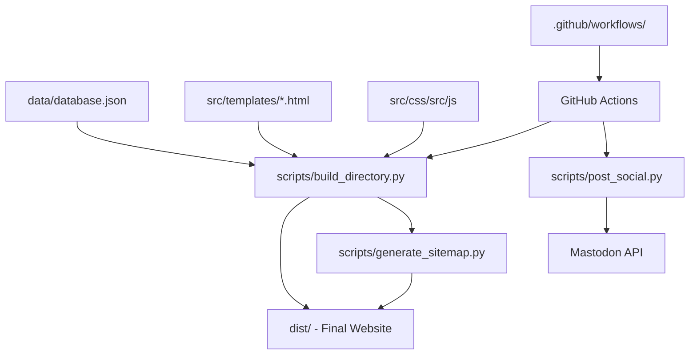

# Technical Requirements & Architecture

This document details the technical specifications, architecture, and dependency requirements for the QuickUtils API Directory.

---

## 1. System Requirements

| Component | Requirement |
|---|---|
| **Operating System** | Linux, Windows, or macOS |
| **Python Version** | **3.11.x** (Required for compatibility with `htmlmin`) |
| **Internet Access** | Required for data syncing and social media posting |
| **Disk Space** | < 100 MB |

## 2. Dependencies & Libraries

The project is built with a minimal dependency footprint to ensure fast builds and long-term stability.

### Core Frameworks
- **Jinja2**: Templating engine for generating thousands of static HTML pages.
- **Python-Slugify**: Ensures consistent and clean URLs for API entities.
- **Requests**: Handles API communication for data fetching and social media posting.

### Build Tools
- **htmlmin**: Minifies output HTML to reduce page load times.
- **Sitemap-Generator**: Dynamically generates `sitemap.xml` for SEO.

## 3. Project Architecture

The project follows a **Jamstack** (JavaScript, APIs, and Markup) approach.



### Key Components

1.  **Static Data Storage**: `data/database.json` serves as the primary "source of truth".
2.  **Build System**: `scripts/build_directory.py` processes the database, renders templates, and enforces minification.
3.  **Deployment Pipeline**: GitHub Actions manages the build environment and pushes the `dist/` folder to Cloudflare Pages.
4.  **Automation Layer**: Independent workflows handle daily social media posts and periodic data synchronization.

## 4. Monetization Integration Logic

### Google AdSense
- **Implementation**: Injected via `base.html` using the `ADSENSE_PUBLISHER_ID` environment variable.
- **Safety**: Conditional rendering ensures that if no ID is present, only a placeholder is shown during development.
- **Compliance**: `src/ads.txt` is automatically served at the domain root.

### Amazon Associates
- **Implementation**: The build script (`build_directory.py`) automatically appends the `AMAZON_AFFILIATE_TAG` to curated book ASINs stored in the recommendations dictionary.
- **Legal**: FTC-compliant disclosures are hardcoded into the item templates.

## 5. Deployment Specs (Cloudflare Pages)

- **Build Command**: `python -m scripts.build_directory && python -m scripts.generate_sitemap`
- **Root Directory**: Project Root (`/`)
- **Output Directory**: `dist`
- **Environment Variables**:
    - `PYTHON_VERSION`: `3.11`
    - `SITE_URL`: `https://directory.quickutils.top`
    - `GA_MEASUREMENT_ID`: Google Analytics (G-XXXX)
    - `ADSENSE_PUBLISHER_ID`: AdSense (ca-pub-XXXX)
    - `AMAZON_AFFILIATE_TAG`: Amazon Tag (tag-20)

## 6. Development Workflow

1.  **Environment Setup**:
    ```bash
    python -m venv .venv
    source .venv/bin/activate  # or .venv\Scripts\activate
    pip install -r requirements.txt
    ```
2.  **Local Testing**:
    ```bash
    # Build the site
    python -m scripts.build_directory
    # Serve locally
    python -m http.server --directory dist 8000
    ```
3.  **Verification**:
    Run `pytest` to ensure templates render correctly and build scripts handle data edge cases.
